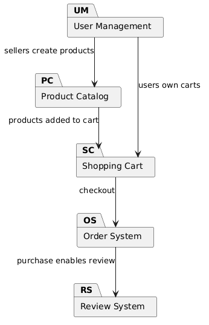
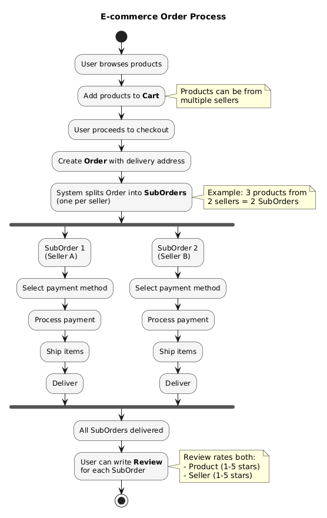
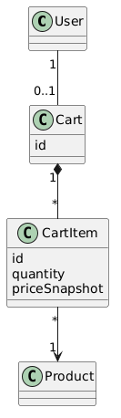
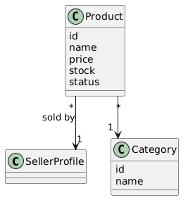
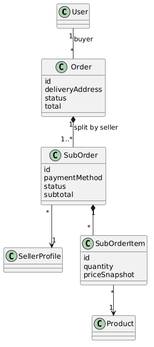
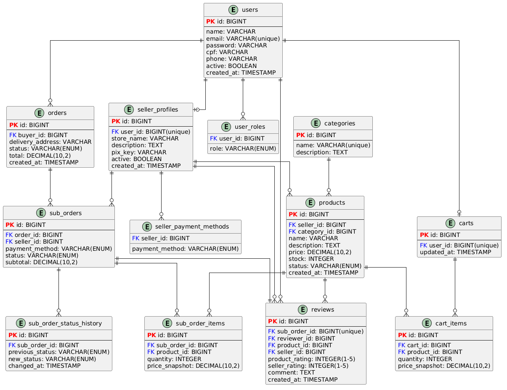

# RELATÓRIO DO PROJETO

---

## CAPA E IDENTIFICAÇÃO

**Disciplina:** Programação Orientada a Objetos

**Projeto:** Plataforma de E-commerce Multi-vendedor

**Título do Projeto:** Sistema Web de E-commerce com Arquitetura Multi-seller (Backend Java/Spring e Frontend React)

**Equipe:**

- Integrante 1: Joaquim Germano Felix
- Integrante 2: Mateus Correia Dias
- Integrante 3: Miguel Mochizuki Silva
- Integrante 4: Gabriel Bringel Gonçalves

**Professor(a):** Gabriel Belarmino  
**Local de armazenamento do código-fonte:** `https://github.com/MiguelMochizukiDev/ecommerce`

---

## 1. Introdução

O projeto desenvolvido consiste em uma plataforma de e-commerce com suporte a múltiplos vendedores, na qual usuários podem atuar como compradores, vendedores ou ambos. A solução foi construída para representar um cenário próximo da realidade de marketplaces atuais, em que um único carrinho pode conter produtos de lojas diferentes, exigindo regras específicas para processamento de pedidos, pagamentos e logística.

O problema principal abordado foi a necessidade de organizar um sistema com diferentes perfis de usuário, múltiplas regras de negócio e relacionamentos complexos entre entidades, sem perder coesão de código e clareza arquitetural. Em sistemas desse tipo, erros comuns ocorrem quando regras de domínio ficam espalhadas em camadas erradas, quando há acoplamento excessivo entre módulos ou quando os dados não refletem corretamente as relações do negócio.

Para enfrentar esse problema, o time adotou uma organização por domínios no backend, com separação explícita entre entidades, repositórios, serviços, controladores e objetos de transferência (DTOs). Essa estratégia permitiu manter responsabilidades bem definidas e facilitar manutenção e evolução do software.

Outro aspecto importante foi a integração entre backend e frontend. O backend expõe uma API REST com autenticação JWT e controle de acesso por papéis, enquanto o frontend em React/TypeScript consome os endpoints para exibir catálogo, carrinho, pedidos e autenticação de usuários. Essa separação permitiu trabalhar o conceito de arquitetura em camadas e comunicação cliente-servidor de forma prática.

Do ponto de vista acadêmico, o projeto foi desenvolvido com foco forte em orientação a objetos (POO), contemplando encapsulamento, abstração, composição, associações entre classes e organização modular orientada ao domínio. A proposta foi não apenas implementar funcionalidades, mas demonstrar como a modelagem orientada a objetos influencia diretamente a qualidade da solução.

---

## 2. Modelagem do problema (UML e abordagem OO)

A modelagem do problema foi documentada por meio de diagramas UML no diretório de documentação do projeto. Foram produzidos diagramas de visão geral, fluxo de processo e diagramas de classes por domínio, o que ajudou a transformar requisitos de negócio em estruturas orientadas a objetos consistentes.

### 2.1 Visão de domínio e classes principais

As classes centrais do sistema podem ser agrupadas em subdomínios:

- **Usuário e vendedor:** `User`, `SellerProfile`, `Role`, `PaymentMethod`
- **Catálogo de produtos:** `Category`, `Product`, `ProductStatus`
- **Carrinho:** `Cart`, `CartItem`
- **Pedidos:** `Order`, `SubOrder`, `SubOrderItem`, `SubOrderStatus`, `SubOrderStatusHistory`
- **Avaliações:** `Review`

Essa separação por domínio favorece entendimento do negócio e reduz acoplamento entre partes não relacionadas.

### 2.2 Relacionamentos e cardinalidades

A UML evidencia relações importantes entre classes:

- Um `User` pode ter um `SellerProfile` (relação de extensão de papel no sistema).
- Um `SellerProfile` possui vários `Product`.
- Um `Category` pode agrupar vários `Product`.
- Um `User` comprador possui um `Cart`, que agrega vários `CartItem`.
- Um `Order` pertence a um comprador e é dividido em vários `SubOrder`.
- Cada `SubOrder` contém vários `SubOrderItem` e histórico de status.
- Uma `Review` está associada a um `SubOrder`, a um produto e a um vendedor.

Essa modelagem atende ao cenário multi-seller: um pedido único do comprador pode ser decomposto em subpedidos por vendedor, permitindo rastreio e processamento independentes.

### 2.3 Foco em Programação Orientada a Objetos (POO)

A implementação aplica POO de forma prática e não apenas teórica.

**a) Encapsulamento**  
As entidades concentram estado e comportamento relacionado ao próprio domínio. Um exemplo é a classe `Product`, que possui o método `updateStock(int quantity)` para atualizar estoque e ajustar automaticamente o status (`ACTIVE` ou `OUT_OF_STOCK`). Em vez de espalhar essa regra em vários pontos do código, a lógica fica encapsulada no próprio objeto.

**b) Abstração**  
Cada classe representa um conceito de negócio com seus atributos essenciais. A classe `Order`, por exemplo, abstrai um pedido do comprador com total, endereço e lista de subpedidos. A complexidade de persistência e transporte é escondida por meio de repositórios e DTOs, mantendo foco no domínio.

**c) Associações, agregação e composição**  
Relações entre classes modelam vínculos reais do negócio. `Order` e `SubOrder` representam uma composição forte no processo transacional: os subpedidos existem como parte do pedido. `Cart` e `CartItem` também seguem uma relação de agregação/composição para representar itens pertencentes ao carrinho.

**d) Coesão e responsabilidade única**  
A organização por camadas orientadas a domínio separa funções com clareza:

- Entidade: representa o estado e comportamento de negócio.
- Repositório: acesso a dados.
- Serviço: regras de negócio e orquestração.
- Controlador: interface HTTP.
- DTO: contrato de entrada/saída.

Essa divisão evita classes “inchadas” e melhora testabilidade.

**e) Polimorfismo e enumerações orientadas ao domínio**  
Embora o sistema não dependa fortemente de herança clássica, há uso de tipos de domínio (enums) como `ProductStatus`, `OrderStatus`, `PaymentMethod` e papéis de usuário (`Role`), permitindo comportamento condicional claro e seguro por tipo.

### 2.4 Padrões e convenções adotados

O projeto adotou convenções importantes para manter consistência:

- Estrutura de pacotes por domínio (`domain/cart`, `domain/order`, etc.).
- Padronização de endpoints REST por recurso (`/api/products`, `/api/orders`, etc.).
- Uso de DTOs para não expor entidade diretamente na API.
- Validação declarativa com Bean Validation em entradas.
- Tratamento centralizado de exceções para respostas padronizadas.
- Nomenclatura clara para classes (`ProductService`, `ProductRepository`, etc.).

### 2.5 UML produzida no projeto

A documentação UML foi segmentada em arquivos PlantUML:

- `docs/overview.puml` (visão geral da arquitetura)
- `docs/action.puml` (fluxo de processo de compra)
- `docs/user-seller-domain.puml`
- `docs/product-catalog-domain.puml`
- `docs/cart-shopping-domain.puml`
- `docs/order-domain.puml`
- `docs/review-domain.puml`
- `docs/entity-relationship.puml` (modelo relacional)

Essa separação permitiu detalhar cada domínio sem perder legibilidade.

#### Diagramas PNG gerados

**Visão geral da arquitetura**

**Fluxo de processo (atividade)**

**Domínio de carrinho e compras**

**Domínio de catálogo de produtos**

**Domínio de pedidos**

**Modelo entidade-relacionamento**

---

## 3. Ferramentas utilizadas

### 3.1 IDE e ambiente de desenvolvimento

Durante o desenvolvimento, foi utilizada uma IDE com suporte completo para Java, Spring Boot, TypeScript e React (principalmente Visual Studio Code), além de extensões para execução, depuração, organização de código e visualização de diagramas PlantUML.

### 3.2 Linguagens de programação

- **Backend:** Java 21
- **Frontend:** TypeScript + React
- **Marcação/documentação:** Markdown e PlantUML

### 3.3 Frameworks e bibliotecas do backend

O backend foi construído com **Spring Boot 3.5.11**, com os seguintes módulos e dependências de destaque:

- Spring Web (API REST)
- Spring Data JPA (persistência)
- Hibernate (ORM)
- Spring Security (autenticação/autorização)
- JWT com `io.jsonwebtoken` (jjwt 0.12.6)
- Bean Validation
- MySQL Connector/J
- Lombok

O gerenciamento de build e dependências foi feito com **Maven** (incluindo wrapper `mvnw`).

### 3.4 Frameworks e bibliotecas do frontend

No frontend, foram adotadas ferramentas modernas do ecossistema React:

- React 19
- React Router DOM
- Axios (requisições HTTP)
- Vite (build e servidor de desenvolvimento)
- TypeScript
- ESLint (qualidade de código)
- Tailwind CSS e PostCSS (estilização)

### 3.5 Segurança e arquitetura

A segurança da aplicação usa autenticação **JWT stateless**, com filtro dedicado para validar token em requisições e controle de acesso por papéis (`BUYER`, `SELLER`, `ADMIN`). O backend segue arquitetura em camadas, e o frontend organiza páginas, componentes reutilizáveis, contextos e serviços de API.

### 3.6 Estrutura de pacotes/módulos

A estrutura definida para o backend foi centrada em domínio:

- `config/`: configurações de segurança, CORS e componentes transversais
- `domain/`: subdomínios de negócio (`cart`, `category`, `order`, `product`, `review`, `seller`, `user`)
- `infra/`: componentes de infraestrutura e segurança

No frontend, a organização principal inclui:

- `components/`: componentes reutilizáveis
- `pages/`: páginas da aplicação
- `contexts/`: gerenciamento de estados globais
- `services/`: integração com API
- `layouts/`: estrutura de layout

Essa estrutura modular favorece evolução do sistema e trabalho colaborativo da equipe.

---

## 4. Resultados e considerações finais

### 4.1 Resultados alcançados

Os resultados obtidos foram consistentes com os objetivos do projeto:

- Implementação de autenticação e autorização com múltiplos papéis.
- Fluxo completo de cadastro de vendedor, produtos e categorias.
- Carrinho funcional com itens e validações.
- Criação de pedidos com divisão em subpedidos por vendedor.
- Suporte a métodos de pagamento por vendedor.
- Sistema de avaliações atrelado ao ciclo de compra.
- Documentação UML e modelo relacional do domínio.

Além das funcionalidades, houve ganho significativo na qualidade estrutural do código por meio da organização orientada a objetos e da separação de responsabilidades.

### 4.2 Dificuldades encontradas

Entre os principais desafios técnicos e de equipe, destacam-se:

- Modelar corretamente relacionamentos complexos entre entidades (especialmente pedidos e subpedidos).
- Definir fronteiras entre regra de negócio e responsabilidades de cada camada.
- Garantir consistência entre backend, banco de dados e frontend durante evolução do escopo.
- Tratar autenticação e autorização de forma segura sem comprometer usabilidade.
- Padronizar convenções de código e documentação entre os integrantes.

Essas dificuldades foram importantes para amadurecer a compreensão do paradigma OO aplicado em projeto real.

### 4.3 Reflexão sobre aprendizagem de linguagem e paradigma OO

A experiência permitiu consolidar conhecimentos de Java e orientação a objetos além do conteúdo introdutório. A equipe percebeu que POO não se resume a “criar classes”, mas sim a:

- representar corretamente o domínio do problema;
- distribuir responsabilidades de forma coesa;
- proteger invariantes de negócio com encapsulamento;
- facilitar manutenção por meio de abstrações adequadas.

Também ficou evidente que decisões de modelagem influenciam diretamente a qualidade do código, a clareza dos fluxos e a capacidade de escalar o sistema.

### 4.4 Feedback e sugestões para a disciplina

Como feedback, a proposta do projeto foi positiva por aproximar teoria e prática em um cenário de mercado. O desenvolvimento exigiu aplicação real de UML, POO, padrões arquiteturais e integração de tecnologias modernas.

Sugestões para a disciplina:

1. Disponibilizar um checkpoint intermediário obrigatório de revisão de modelagem UML.
2. Incluir rubrica específica para avaliação de encapsulamento e coesão das classes.
3. Reservar uma etapa curta de revisão entre equipes para troca de práticas.
4. Estimular testes automatizados como critério adicional de qualidade.

Em síntese, o projeto cumpriu seu papel formativo ao exigir raciocínio orientado a objetos, organização de código e visão sistêmica de desenvolvimento de software.

---

## Referências técnicas do projeto

- Documentação e diagramas UML no diretório `docs/`
- Backend Java/Spring em `backend/`
- Frontend React/TypeScript em `frontend/`
- Repositório: este repositório GitHub
